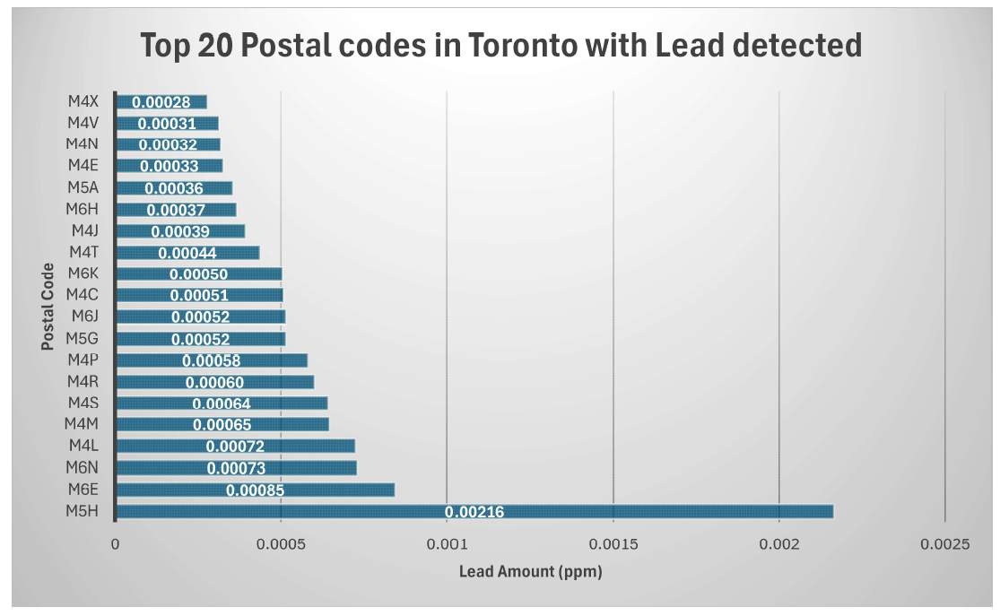

# Data Visualization

## Assignment 3: Final Project

### Python Visualization

For this assignment, I chose to visualize the data collected from non-regulated Lead sampling in the city of Toronto **[1]** (see "Non_Regulated_Lead_Samples.csv"). The data is collected from water sampling kits that residents can pick up and drop off. It consists of a sample_id, and sample_date,  the postal code of collection, and the lead amount detected in ppm (parts per million).

- Excel was used for this visualization. The Excel notebook can be found in this directory named "Excel_visualization.xlsx". For a high quality version of the visualiztion, please refer to the pdf file "Lead_Concentration_Toronto_excel.pdf".
- Given the more academic nature of this plot, the intended audience for this are city officials who require this data for better planning, or researchers studying the topic.
- The plot displays the Top-20 postal codes with average lead concentration (in ppm) in water samples collected throughout the year in the GTA area. 
- The visualization is a simple bar-plot with the Lead amount (in ppm) shown on the x-axis vs the 20 postal codes with the highest amounts detected. The bar graph is clear, concise, and to the point, with a neutral background. 
- Unfortunately, since the plot is in Excel, the visualization script is not entirely reproducible (see "Excel_visualization.xlsx"). However, all the data in the Excel sheets is completely reproducible, just the visualization style is not.
- The plot is color neutral, and marks the actual Lead levels inside each bar on the graph for better readability. This helps improve accessibility.
- The plot clearly marks the postal codes which have the worst Lead levels detected. The residents of these neighborhoods are at the highest risk and hence require careful planning from the Toronto local government.
- Plotting a bar graph for ~100 postal codes is not feasible. Hence, I chose to pick the top 20 worst Lead levels detected since those are the areas which require the most attention due to the high health hazard.
- The dataset required cleaning up. It reported the lead amount as text, which needed to be converted into floating point (see "Lead_Sample_cleaned.csv"). This cleaned up data was then imported into Excel for plotting.

## References
- [https://open.toronto.ca/dataset/non-regulated-lead-sample/](https://open.toronto.ca/dataset/non-regulated-lead-sample/)
