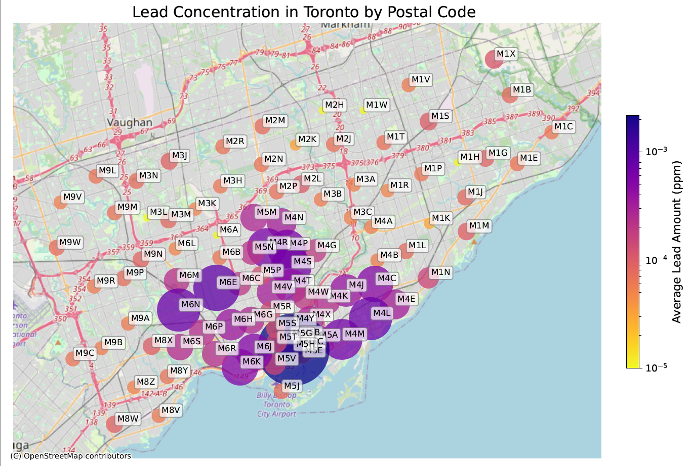

# Data Visualization

## Assignment 3: Final Project

### Python Visualization

For this assignment, I chose to visualize the data collected from non-regulated Lead sampling in the city of Toronto **[1]** (see "Non_Regulated_Lead_Samples.csv"). The data is collected from water sampling kits that residents can pick up and drop off. It consists of a sample_id, and sample_date,  the postal code of collection, and the lead amount detected in ppm (parts per million).

- Python was used for this visualization. The Jupyter notebook can be found in this directory named "python_visualization.ipynb". For a high quality version of the visualiztion, please refer to the pdf file "Lead_Concentration_Toronto_python.pdf".
- The intended audience for this are the residents of Toronto who will be affected by the Lead levels found in water samples.
- The plot displays the average lead concentration (in ppm) in water samples collected throughout the year in the GTA area, segregated by Postal codes. 
- The visualization is a map where the relevant data is plotted as markers overlayed on top of an actual map of the GTA area with clearly labelled postal codes. The average lead amount is plotted using a scatter plot with the size and color of the markers depending on the amount detected for clear visualization which is immediately readable. the colorscheme used strikes a balance between visual clarity, while at the same time avoiding the misdirection which multi-color schemes can fall into. Furthermore, to cover a large range of values, I chose a log-normalization for the colorbars.
- The visualization script is completely reproducible and can be found in "python_visualization.ipynb".
- The Lead levels can be clearly interpreted from the visualization not only through the color of the markers, but also their sizes. This makes it accessible to colorblind people. Furthermore, all the postal codes are clearly marked on the map for clear labelling.
- Observing the trends in the plot, it is clear that the average Lead amount is much higher in the southern part of GTA, especially areas near the lake shore like downtown Toronto. These are the critical areas where people will be affected the most.
- The dataset contains multiple samples for each postal code, as well as sample dates. However, for simplicity, I chose to plot the average lead detected over the entire data collection period. An alternative would have been a dynamic plot which shows the trend with time. Furthermore, maybe the standard deviation could be plotted in a separate plot altogether.
- The dataset required cleaning up. It reported the lead amount as text, which needed to be converted into floating point. To plot on top of an actual map, I needed geocode data of latitude and longitude for each postal code in Toronto. I acquired this as another data file from **[2]** (see "CA.txt"). Both these data then needed to be combined into a single "geoDataFrame" for packages like contextily to plot on top of maps (see "Lead_Sample_cleaned.csv").

## References
- [https://open.toronto.ca/dataset/non-regulated-lead-sample/](https://open.toronto.ca/dataset/non-regulated-lead-sample/)
- [https://www.geonames.org/export/](https://www.geonames.org/export/)