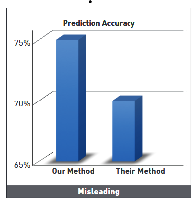
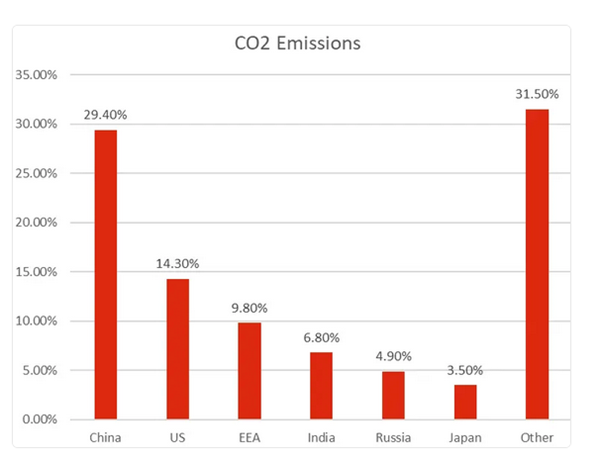
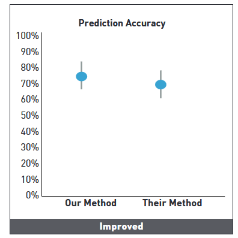

# Data Visualization

## Assignment 2: Good and Bad Data Visualization

### Requirements:

- Data visualizations are important tools for communication and convincing; we need to be able to evaluate the ways that data are presented in visual form to be critical consumers of information 
- To test your evaluation skills, locate two public data visualizations online, one good and one bad  
    - You can find data visualizations at https://public.tableau.com/app/discover or https://datavizproject.com/, or anywhere else you like! 
- For each visualization (good and bad):  
    - Explain (with reference to material covered up to date, along with readings and other scholarly sources, as needed) why you classified that visualization the way you did.
    - 
      ```
      One of the clearest examples of how poor design choices in data visualization can mislead viewers is shown in Fig.1 of [1], which compares the performance of two methods using a 3D bar chart. At first glance, the graph suggests that “Our Method” is vastly superior to “Their Method,” as the corresponding bar is nearly twice as tall. However, a closer inspection reveals that the actual difference in prediction accuracy is only 5%—from 65% to 70%. This illusion is caused by three design flaws: a truncated Y-axis starting at 65% instead of zero, the use of 3D bars, and a lack of clear contextual labeling. 

      First, truncating the Y-axis exaggerates visual differences. Our perceptual system is hardwired to interpret the length of a bar as proportional to the value it represents. When the baseline is lifted from zero, it warps this relationship and misleads the eye [1]. Second, the use of 3D effects further distorts perception by manipulating depth cues and angles, which are harder to resolve, especially on static, 2D media. Visual clutter and unnecessary visual effects reduce clarity and can overwhelm viewers, particularly those with sensory sensitivities [1]. Third, the chart lacks clear direct labeling and descriptive annotation, which would be vital for comprehension and screen-reader accessibility. Without clear written cues, users relying on assistive tech, or even general audiences glancing quickly, may not understand what the graph is truly showing.
      ```
    - 
        ```
       In contrast, the bar chart titled “CO2 Emissions” is a standout example of well-designed, accessible, and truthful data visualization [2]. It presents global CO₂ emissions by major countries and regions, including China, the US, EEA, India, and others. Each category is represented by a vertical bar, with values clearly displayed both as bar height and as direct numerical labels. The Y-axis starts at 0%, extending to 35%, ensuring that differences between emissions are accurately and proportionally represented. For example, the viewer can easily perceive that China’s 29.4% and the “Other” group’s 31.5% are relatively close, and that the US contributes about half as much as China at 14.3%. This clarity is achieved through simple, consistent visual encoding without distortion, making the chart an exemplary case of accessible and honest data communication.

        What makes this graph particularly effective is its alignment with accessibility principles outlined in the slide deck. First, the Y-axis begins at zero, which maintains visual integrity. This prevents exaggerated differences, a known issue in misleading graphs. By doing so, it ensures that the chart supports perceptual fairness required for accessible and ethical visualization. Second, the design is clean, flat, and free from unnecessary embellishments like 3D effects or rainbow color schemes, which could distract or mislead. This supports viewers with cognitive load challenges or visual sensitivity, making the graph more broadly accessible. Third, and most importantly, the graph uses direct textual labeling on each bar to indicate the precise emission percentage. This is crucial for accessibility [3]. Viewers with color vision deficiencies, dyslexia, or screen-reader dependencies benefit greatly from this approach. Data labels reduce reliance on color interpretation and ensure the information is accessible to users who might otherwise struggle to decode the visual language. 
        ```

    - How could this data visualization have been improved?  
    
      ```
      To correct the aforementioned issues, we should first anchor the Y-axis at zero, preserving visual proportionality and restoring perceptual accuracy. Second, the 3D design should be eliminated in favor of a simple, flat 2D bar chart to remove projection distortion and occlusion, which is in line with accessibility best practices that discourage complex visual effects [1]. Third, the chart should feature explicit axis labels and direct data labeling on each bar. Labels enhance clarity, minimize color dependence, and support users with cognitive impairments or vision loss [3]. These changes would ensure that the graph is not only visually truthful, but also inclusive, readable, and perceptually accurate for a broader audience.
      ```
    - **REFERENCES**
      - "The good, the bad, and the biased: five ways visualizations can mislead (and how to fix them)", Danielle Albers Szafir, [https://doi.org/10.1145/3231772](https://doi.org/10.1145/3231772).
      - [https://www.polymersearch.com/blog/10-good-and-bad-examples-of-data-visualization](https://www.polymersearch.com/blog/10-good-and-bad-examples-of-data-visualization)
      - Alcaraz-Martínez, R., Ribera, M., Adeva-Fillol, A. et al. "Enhancing statistical chart accessibility for people with low vision: insights from a user test." Univ Access Inf Soc (2024). [https://doi.org/10.1007/s10209-024-01111-4](https://doi.org/10.1007/s10209-024-01111-4)
- Word count should not exceed (as a maximum) 500 words for each visualization (i.e. 
300 words for your good example and 500 for your bad example)

### Why am I doing this assignment?:

- This assignment ensures active participation in the course, and assesses the learning outcomes
* Apply general design principles to create accessible and equitable data visualizations
* Use data visualization to tell a story

### Rubric:

| Component               | Scoring   | Requirement                                                 |
|-------------------------|-----------|-------------------------------------------------------------|
| Data viz classification and justification | Complete/Incomplete | - Data viz are clearly classified as good or bad<br />- At least three reasons for each classification are provided<br />- Reasoning is supported by course content or scholarly sources |
| Suggested improvements  | Complete/Incomplete | - At least two suggestions for improvement<br />- Suggestions are supported by course content or scholarly sources |

## Submission Information

🚨 **Please review our [Assignment Submission Guide](https://github.com/UofT-DSI/onboarding/blob/main/onboarding_documents/submissions.md)** 🚨 for detailed instructions on how to format, branch, and submit your work. Following these guidelines is crucial for your submissions to be evaluated correctly.

### Submission Parameters:
* Submission Due Date: `23:59 - 30/04/2025`
* The branch name for your repo should be: `assignment-2`
* What to submit for this assignment:
    * This markdown file (assignment_2.md) should be populated and should be the only change in your pull request.
* What the pull request link should look like for this assignment: `https://github.com/<your_github_username>/visualization/pull/<pr_id>`
    * Open a private window in your browser. Copy and paste the link to your pull request into the address bar. Make sure you can see your pull request properly. This helps the technical facilitator and learning support staff review your submission easily.

Checklist:
- [ ] Create a branch called `assignment-2`.
- [ ] Ensure that the repository is public.
- [ ] Review [the PR description guidelines](https://github.com/UofT-DSI/onboarding/blob/main/onboarding_documents/submissions.md#guidelines-for-pull-request-descriptions) and adhere to them.
- [ ] Verify that the link is accessible in a private browser window.

If you encounter any difficulties or have questions, please don't hesitate to reach out to our team via our Slack. Our Technical Facilitators and Learning Support staff are here to help you navigate any challenges.
